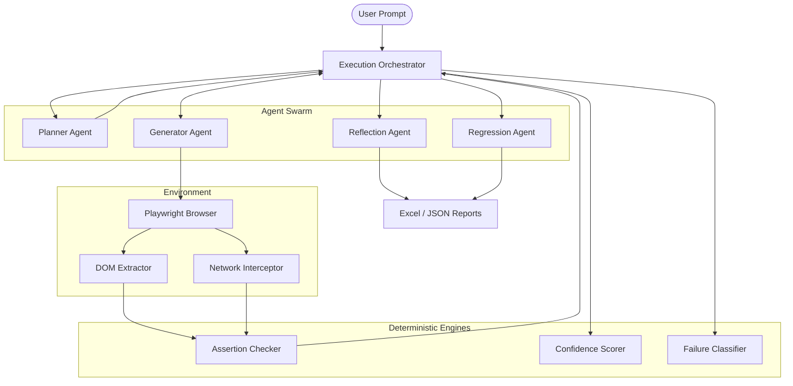
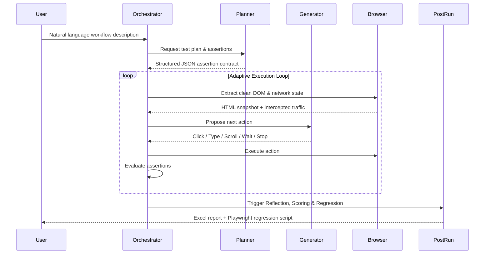

# <div align="center">Autonomous User-Journey QA Agent</div>

<p align="center">
  <a href="#license"></a>
  
  
  
  
  
</p>

> **Eliminate brittle UI scripts. A fully autonomous QA agent that plans, executes, reflects, and reports on web testing — powered by AMD AI.**

---

## 🎥 Demo Video

Watch the complete 5-minute demonstration covering all core capabilities:

**[▶ Watch Demo on Google Drive](https://drive.google.com/file/d/1YanieQ-A2P0G1wv03hTpC-qfLOc4NfCc/view?usp=drive_link)**

The demo covers:
- **Adaptive planning** — Natural language workflow → structured assertion contract
- **Browser execution** — Live autonomous browser navigation
- **Reflection** — Post-execution root-cause analysis via AMD AI
- **Failure classification** — Deterministic UI / Network / LLM failure taxonomy
- **Confidence scoring** — Heuristic reliability score (0.0–1.0) per scenario
- **Report generation** — 8-sheet Excel output with timeline and AI reasoning

---

## 🛑 Problem Statement

Traditional QA automation is broken. Engineers write thousands of brittle Selenium or Playwright scripts that fail the moment a developer changes a CSS class, an ID, or a layout structure. When a script fails, it leaves behind a generic "Timeout Exception," forcing QA engineers to spend hours debugging whether the application is actually broken or whether the script just needs updating.

This creates a massive bottleneck in continuous delivery, where the cost of maintaining tests exceeds the value they provide.

---

## ⚡ Why This Project Is Different

| Capability | Traditional QA (Playwright/Cypress) | Adaptive Agentic QA |
| :--- | :--- | :--- |
| **Execution** | Static, hardcoded steps | Adaptive execution loop — recovers from UI changes |
| **Element Selection** | Brittle CSS/XPath selectors | LLM-driven DOM interpretation with ranked fallback probing |
| **Test Planning** | Manual script writing | Planner Agent auto-generates structured assertion contracts |
| **Failure Analysis** | Manual log diving | Reflection Agent diagnoses root cause via AMD AI |
| **Failure Classification** | None | Deterministic: UI / Network / LLM / Assertion |
| **Confidence Scoring** | Binary (Pass/Fail) | Continuous heuristic score (0.0–1.0) |
| **Regression Fixes** | Manual PR updates | Regression Agent auto-generates Playwright `.spec.ts` files |

---

## 💡 Solution

The **Autonomous User-Journey QA Agent** accepts a natural language prompt (e.g., *"Login and verify the user dashboard loaded"*). It provisions a team of specialized AI agents that work in sequence to:

1. **Plan** — Synthesize a structured JSON assertion contract from the prompt.
2. **Execute** — Interactively drive the browser, recovering from popups and layout changes.
3. **Assert** — Validate state visually and via intercepted HTTP traffic.
4. **Reflect** — Generate root cause analysis and actionable suggestions.
5. **Score** — Compute a deterministic confidence score for the run.
6. **Report** — Emit a comprehensive Excel report with full execution timeline.

---

## 🚀 Features

- **Agentic Execution Loop** — Observes the DOM, decides the next action, and evaluates assertions until the workflow succeeds or definitively fails.
- **Visual & Network Assertions** — Verifies state not just by looking at the screen, but by inspecting intercepted HTTP traffic payloads.
- **Failure Classifier** — Deterministically categorizes failures into UI, Network, LLM, or Assertion failures — no LLM involved.
- **Confidence Scorer** — Scores the reliability of the test run, discounting results where the model produced invalid output or the network timed out.
- **Reflection Engine** — An isolated AMD AI call that analyzes the full execution log and generates actionable suggestions and root-cause summaries.
- **Regression Code Generation** — Synthesizes a stable, Playwright-ready TypeScript spec file from the successful autonomous run, bridging agentic exploration to CI/CD stability.
- **Cross-Provider Benchmarking** — Objectively measures AMD, GitHub Models, and Ollama side by side on latency, TTFT, token counts, and JSON validity.

---

## 🏗 Architecture



---

## 🔄 Agent Workflow



---

## 🧠 Engineering Challenges & Solutions

- **Strict Agent Isolation** — The Reflection Agent never runs inside the execution loop. This enforces clean separation of concerns: execution stays fast, and reflection has access to the full, immutable timeline.
- **Deterministic Enveloping** — LLMs hallucinate. The Failure Classifier and Confidence Scorer are strictly deterministic algorithms with no LLM calls, wrapping AI output in verifiable heuristics.
- **Provider Abstraction (Factory Pattern)** — `ProviderFactory` routes all agent calls through a single `ModelProvider` interface. Swapping AMD for GitHub Models or Ollama requires changing exactly one environment variable.
- **One-Action-at-a-Time Loop** — Instead of generating a full script upfront, the Generator Agent proposes one action at a time. This mirrors human QA testing, allowing natural recovery from unexpected overlays and popups.

---

## 🔴 AMD AI DevMaster Hackathon Integration

**Currently Implemented:**
- **Inference Provider** — Deep integration with the AMD-provisioned Fireworks AI inference endpoint (`api.fireworks.ai/inference/v1`).
- **OpenAI-Compatible Bridge** — `AMDModelProvider` enforces strict JSON schema generation against the Fireworks OpenAI-compatible API.
- **Model** — `accounts/fireworks/models/deepseek-v4-flash-0731` (AMD hackathon provisioned).
- **Cross-Model Benchmarking** — `npm run benchmark` compares AMD latency and TTFT against GitHub Models and Ollama with identical prompts.

**Future Roadmap (AMD Hardware):**
- Full ROCm integration for offline, local test execution on Radeon GPUs.
- Running the Planner and Reflection agents on-device via ONNX/llama.cpp, delegating only the Generator to cloud inference.

---

## 📁 Project Structure

```text
├── src/
│   ├── agents/          # Planner, Generator, Reflection, Regression, Evaluator, Confidence, Failure Classifier
│   ├── ai/              # ProviderFactory, modelProvider (AMD/GitHub/Ollama), providerConfig
│   ├── browser/         # Playwright controller, actionDispatcher, DOM parser, network analyzer
│   ├── core/            # Orchestrator, retry logic, state, types
│   ├── reporting/       # Excel sheet builders (8 sheets), output manager
│   └── index.ts         # Interactive CLI entry point
├── benchmark/           # Benchmark runner and results
├── output/              # Generated Excel reports, timelines, regression scripts
├── config/              # config.json (headless, timeout, automation tool)
└── .env.example         # Environment configuration template
```

---

## ⚙️ Installation

```bash
# 1. Clone the repository
git clone https://github.com/Prakhar601/User-Journey-QA-agentic-tool.git
cd User-Journey-QA-agentic-tool

# 2. Install dependencies
npm install
npx playwright install chromium

# 3. Configure environment
cp .env.example .env
# Edit .env — set AMD_API_KEY and MODEL_PROVIDER=amd
```

---

## 🏎 Quick Start

```bash
# Interactive mode — prompts for URL, credentials, and workflow
npm run dev

# Non-interactive CI mode (reads all config from .env)
npm run launch

# Cross-provider benchmark
npm run benchmark
```

---

## 📊 Generated Reports

Every run writes to `output/` with two Excel files:

**`TestResults.xlsx`** (8 sheets):

| Sheet | Contents |
|---|---|
| Test Results | Confidence %, failure class, reflection summary — all in one row |
| Executive Summary | High-level pass rate and timing |
| System Analysis | API call counts and UI render time |
| Summary | Network waterfall and AI analysis |
| AI Reflection Report | Per-scenario root cause, suggestions, retry recommendation |
| Execution Timeline | Every pipeline stage with timestamp and status |
| Run Summary | Average confidence, provider, model, version |
| Provider Benchmark | Latency comparison when benchmarkResults are included |

**`RegressionReport.xlsx`** — Generated Playwright test code in tabular form.

---

## 🗺 Future Roadmap

- **Local ROCm Inference** — Offload Planner and Reflection agents to a local Radeon GPU.
- **Multi-Tab Execution** — Support complex SSO workflows that open new browser contexts.
- **Visual Diffing** — Pixel-perfect snapshot regression alongside DOM/network assertions.
- **Self-Healing Selectors** — Use generated Playwright scripts as CI baselines; re-engage the LLM only when a selector breaks.

---

## 🤝 Contributing

Contributions are welcome. Ensure `npm run build` passes before opening a Pull Request. Do not break the `ProviderFactory` abstraction when adding new LLM providers.

---

## 📝 License

Distributed under the MIT License. See [`LICENSE`](LICENSE) for details.

---

## 📫 Contact

Project: [https://github.com/Prakhar601/User-Journey-QA-agentic-tool](https://github.com/Prakhar601/User-Journey-QA-agentic-tool)
